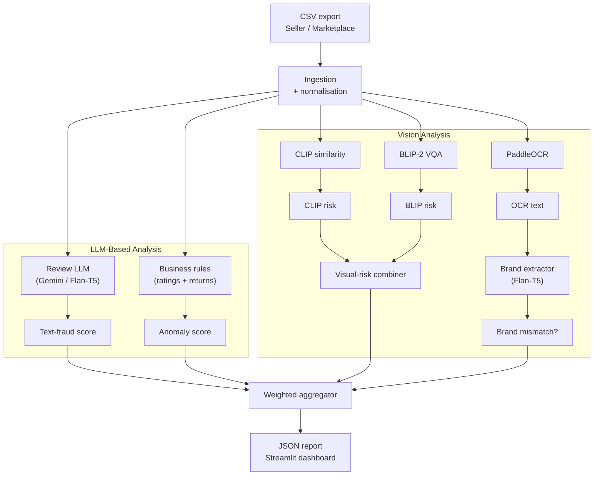

# TrustGuard+

<p align="center">
  
  <br/>
  <strong>Instant counterfeit &amp; trust-fraud detection for e-commerce listings</strong>
</p>

---

## ✨ Overview

I built **TrustGuard +** to solve a simple problem: huge marketplaces make it hard to spot fake items and sketchy reviews.  
The tool takes any product export (CSV or an API dump), checks every listing, and hands back one clear number — a **Trust Score (0-100)**.

here’s what happens:

1. **Reads your data** – point it at the CSV you already have.  
2. **Looks at everything** – reviews, photos, star ratings, return counts, even the logo printed on the product.  
3. **Runs quick AI checks on your own machine** – nothing leaves your server.  
4. **Writes a tidy JSON report** – plus a Streamlit page so moderators can skim results.

One run and you know which products look clean and which need a closer look.

| Module | Models under the hood | Flags                         |
|--------|----------------------|-------------------------------|
| **Review LLM**       | Gemini 1.5 Pro / Flan-T5    | Copy-pasted or bot-generated reviews |
| **Vision Risk**      | CLIP + BLIP-2 (OPT 2.7 B)  | Stock / unrelated product photos     |
| **Brand Match**      | PaddleOCR + Flan-T5        | Logo on image ≠ brand in title        |
| **Rules Engine**     | Simple heuristics          | Rating spikes, abnormal return ratios |

Everything is fused through a weighted aggregator and explained in plain English.

---



</div>

---

## Key Modules

| Folder | What it does |
|--------|--------------|
| `trustguard/ingest.py` | Normalises any Amazon–style CSV into a clean, deduped stream of listings. |
| `trustguard/review_llm.py` | Uses a cached LLM (Gemini 1.5 Pro or Flan‑T5) to spot review fraud. |
| `trustguard/visual_clip.py` | Combines **CLIP** similarity with **BLIP‑2** VQA for image/title consistency. |
| `trustguard/brand_match.py` | Runs **PaddleOCR** → extracts brand with Flan‑T5 → fuzzy‑matches title. |
| `trustguard/rules.py` | Simple statistical rules (rating distribution, return spikes). |
| `trustguard/scoring.py` | Final weighted aggregation → _Trust Score_ (0‑100) & verdict. |
| `scripts/batch_run.py` | One‑shot CSV → `reports.json`. |
| `dashboard/app.py` | Streamlit moderator queue. |

---

## Quick start

```bash
# 1. Install deps (CUDA optional)
pip install -r requirements.txt

# 2. Run a batch audit
python scripts/batch_run.py --csv data/amazon_sneakers_all2.csv --out reports.json

# 3. Open the dashboard
streamlit run dashboard/app.py
```

Environment variables required:

| Name | Purpose |
|------|---------|
| `GOOGLE_API_KEY` | Gemini review‑fraud scoring & OCR fallback |
| `LLM_MODEL` | e.g. `gemini-1.5-pro` or `google/flan-t5-large` |
| `CLIP_VARIANT` | OpenAI `ViT‑L/14@336px` works well |
| `EMBED_MODEL` | `sentence-transformers/all-MiniLM-L6-v2` |

---

## Scoring rubric

| Signal | Weight | Meaning of **1.0** |
|--------|--------|--------------------|
| `text_score` | 0.20 | reviews look entirely fake |
| `visual_score` | 0.20 | title/image clearly unrelated |
| `rule_score` | 0.20 | extreme rating / return anomaly |
| `brand_mismatch` | 0.40 | brand on image **≠** brand in title |

`Trust Score = 100 × (1 – weighted risk)`  
Default _listable_ threshold = **70**.

---

## Contributors

* **Harish Muthubalakrishnan**  
* **Benicia A**  
* **Mahalakshmi P C**

---

## Disclaimer

Prototype only – not affiliated with Amazon.  
All brand names & images belong to their respective owners.
